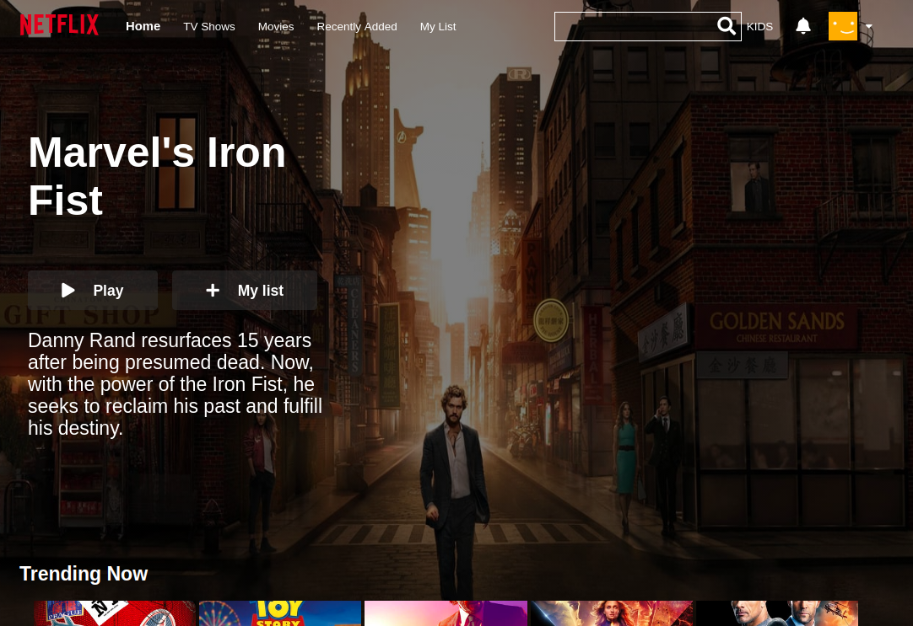
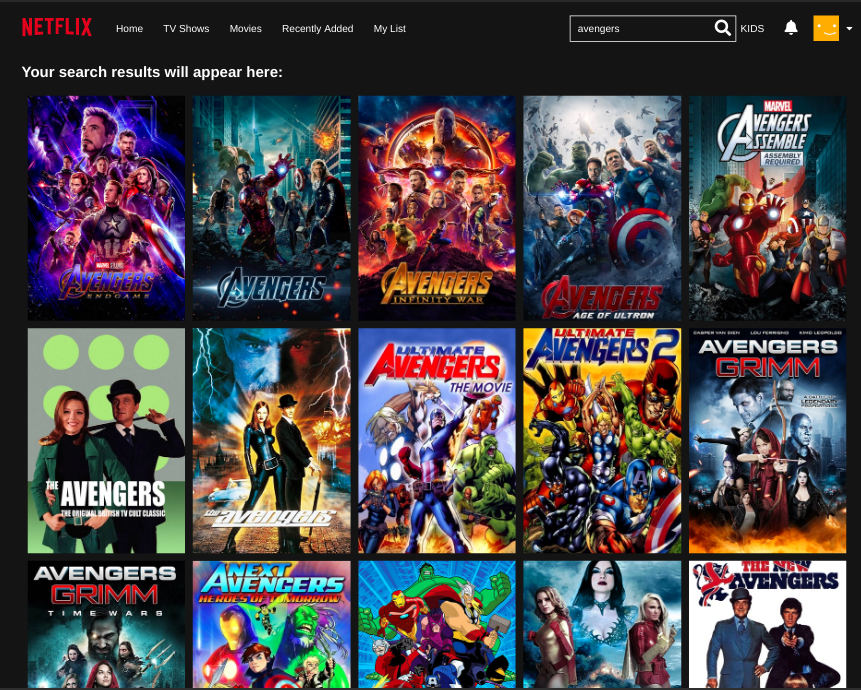
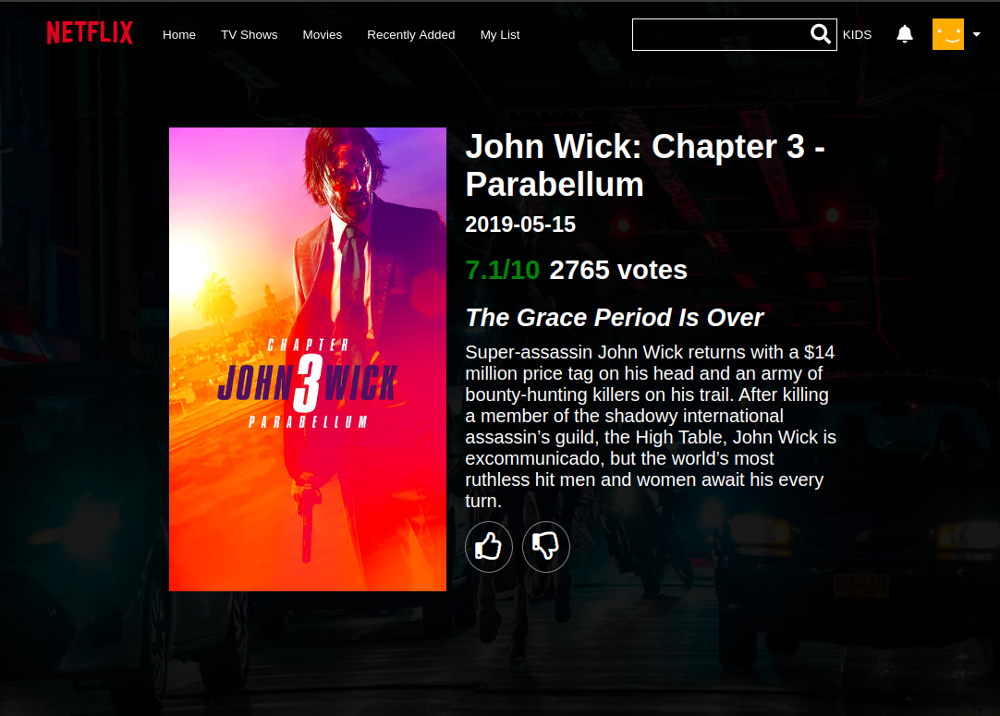
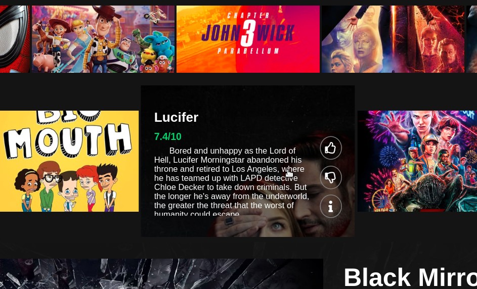
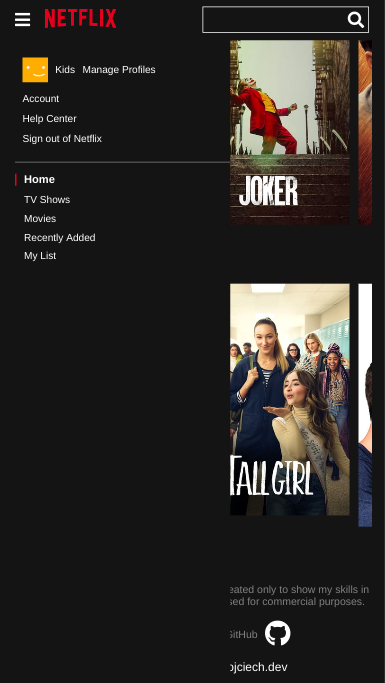
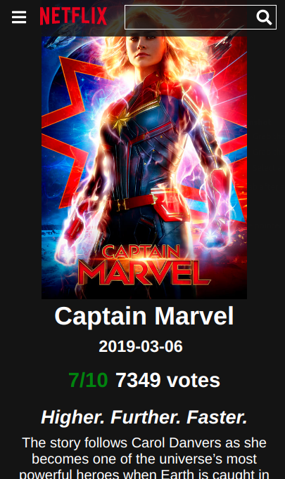
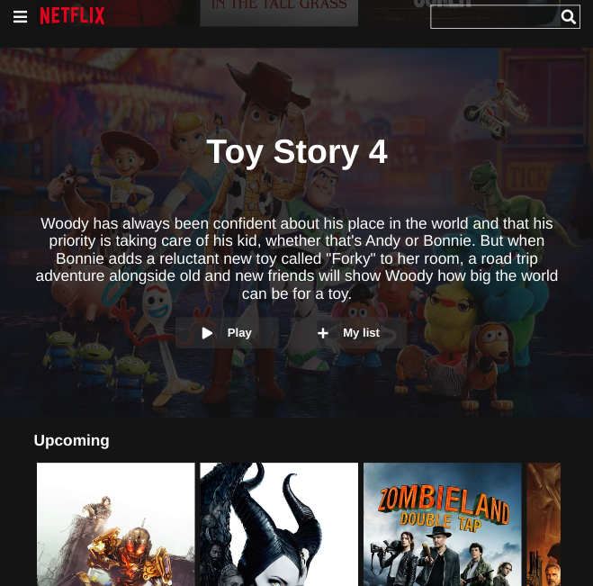

# Netflix Clone
### kind of...

# Web application that allows you to search the database of movies and TV series using **TMDB** API
## Appearance of the application is modeled on Netflix, but not every feature works (my list, account switch, avatar change etc), because the main purpose of this application is to display content using external API

## The user can search for any series and film and check its rating, release date, description, etc .

## Pages display sliders with updated titles, divided into the latest, best rated, by genre, etc.

## This app is also responsive
  
